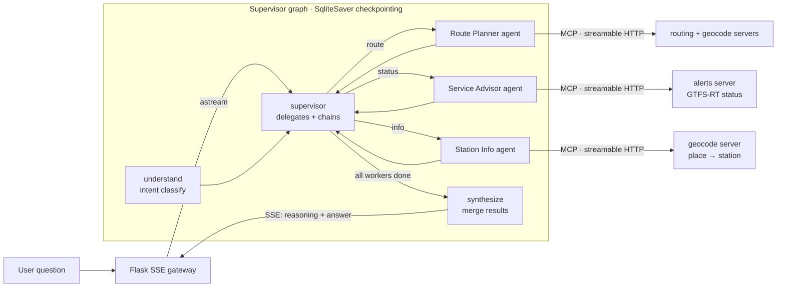

# Smart City Navigator — Multi-Agent Transit Planner

A natural-language NYC subway planner built as a **LangGraph** *multi-agent system*:
a **supervisor** delegates each question to independent specialist agents
(Route Planner, Service Advisor, Station Info) that reason over **three MCP tool
servers** (live GTFS-RT alerts, Dijkstra routing, geocoding) speaking the
**Model Context Protocol over streamable HTTP**, exposed through a **Flask
Server-Sent-Events gateway** that streams the agents' reasoning live, and validated
by **LangSmith tracing** plus a **20-prompt eval suite**.

Ask *"How do I get from Times Square to Coney Island?"* and watch the agent
understand the query, call the routing tool, and synthesize a grounded itinerary —
never a hallucinated one.

```
Take the N from Times Sq–42 St to Coney Island–Stillwell (19 stops).
About 41 min, 19 stops, no transfers.
```

The transit core (63-station graph, Dijkstra planner, GTFS-RT feed pipeline with a
fault-tolerant simulation fallback) is ported from its sibling project, the
**NYC Transit Hub** real-time dashboard, so both projects share one authoritative
model of the network.

---

## Architecture



Each specialist is its **own** LangGraph agent — its own compiled `plan → tools →
finish` subgraph, persona/system prompt, and tool subset. The supervisor delegates
by intent and can **chain agents** for compound questions (*"...to Fulton St and
are there delays?"* runs the Route Planner **and** the Service Advisor, then merges).

Inside each agent the reasoner is **Gemini** doing tool-calling when
`GEMINI_API_KEY` is set; otherwise a **deterministic planner** (regex intent + entity
extraction) emits the *same* tool calls — so every agent, the MCP servers, and the
whole eval suite run end-to-end in CI with no API key and zero flakiness.

## Resume claims → where they live

| Claim | Implementation |
|---|---|
| **Multi-agent** transit planner — supervisor delegating to specialist worker agents | [`agent/graph.py`](src/navigator/agent/graph.py) (supervisor + routing), [`agent/workers.py`](src/navigator/agent/workers.py) (3 agents) |
| LangGraph orchestrator, **TypedDict state**, **conditional routing**, **SqliteSaver checkpointing** across query-understanding / route-planning / synthesis nodes | [`agent/graph.py`](src/navigator/agent/graph.py), [`agent/state.py`](src/navigator/agent/state.py), [`agent/nodes.py`](src/navigator/agent/nodes.py) |
| **3 MCP tool servers** (GTFS-RT alerts, Dijkstra routing, geocoding) with **FastMCP** over **streamable HTTP** | [`mcp_servers/`](src/navigator/mcp_servers/) |
| LLM acts on real-time MTA data **through a standardized protocol** | tools loaded via `langchain-mcp-adapters` `MultiServerMCPClient` — [`agent/tools.py`](src/navigator/agent/tools.py) |
| **Flask gateway** with **Server-Sent Events** for live agent-reasoning visibility | [`gateway/app.py`](src/navigator/gateway/app.py) |
| **LangSmith tracing** + **20-prompt eval set** (happy paths, ambiguous queries, tool-failure handling) | [`eval/`](eval/) |
| Fault-tolerant execution / graceful degradation | SqliteSaver checkpoints (resumable) + GTFS-RT simulation fallback ([`core/mta_feed.py`](src/navigator/core/mta_feed.py)) |

## The specialist agents

The supervisor delegates to three independent worker agents, each with its own
persona and tool subset ([`agent/workers.py`](src/navigator/agent/workers.py)):

| Agent | Owns | Handles |
|---|---|---|
| **Route Planner** | routing + geocode tools | "how do I get from X to Y" |
| **Service Advisor** | alerts tools | delays, suspensions, outages |
| **Station Info** | geocode + station tools | which lines serve X, nearest station |

## The three MCP servers

Each wraps one slice of the transit core and is independently runnable
(`python -m navigator.mcp_servers.<name>_server`).

| Server | Port | Tools |
|---|---|---|
| **alerts** | 8071 | `get_service_status`, `get_line_status`, `list_elevator_outages` |
| **routing** | 8072 | `plan_trip`, `plan_trip_by_id`, `list_stations` |
| **geocode** | 8073 | `geocode_place`, `resolve_station`, `nearest_station` |

## Quickstart

```bash
make install          # venv + dependencies
make test             # 49 unit/integration tests
make eval             # 20-prompt eval suite → 20/20

# Run the whole system (3 MCP servers + gateway), then open http://localhost:8000
make run

# Or just talk to it on the CLI (no servers needed):
make demo Q='"How do I get from Bedford Av to Herald Sq?"'
```

CLI reasoning trace:

```
Q: How do I get from Bedford Av to Herald Sq?
  [understand] Understood the question; intent = 'route'.
  [plan]       Calling tools: plan_trip
  [tools]      …
  [plan]       Gathered tool results; composing the answer.
  [synthesize] Composed the final grounded answer.

Answer: Take the L from Bedford Av to Union Sq–14 St (5 stops); transfer to the
        N from Union Sq–14 St to Herald Sq–34 St (3 stops). About 18 min, 8 stops, 1 transfer.
```

## Enabling the real LLM & tracing

```bash
cp .env.example .env         # then set the keys you have
export GEMINI_API_KEY=...    # Gemini does the tool-calling instead of the planner
export LANGSMITH_API_KEY=... # every node/tool call becomes traceable
python eval/run_eval.py --langsmith   # scored experiment logged to LangSmith
```

Nothing is required — with no keys the agent uses the deterministic planner and the
simulated feed, and every command above still works.

## Evaluation

`eval/run_eval.py` runs 20 prompts across three buckets and grades each with the
heuristics in `eval/graders.py`:

- **happy_path (10)** — routes, line/service status, station info that must succeed
- **ambiguous (5)** — endpoints matching several stations (e.g. *"125 St"*): the
  agent must ask *which* rather than guess
- **tool_failure (5)** — unknown places/lines, degenerate trips, a stubbed feed, and
  out-of-scope questions: the agent must degrade gracefully and **never fabricate a route**

The suite runs with the live GTFS-RT feed stubbed, so every status answer also
exercises the fault-tolerant simulation fallback. CI (`.github/workflows/ci.yml`)
gates merges on `pytest` **and** a 100% eval pass rate, on Python 3.10 and 3.11.

## Project layout

```
src/navigator/
  core/          transit domain — graph, routing, geocode, GTFS-RT feed, cache (no frameworks)
  mcp_servers/   3 FastMCP servers over streamable HTTP
  agent/         supervisor graph, specialist worker agents, state, LLM factory + planner, tool loading
  gateway/       Flask JSON + SSE gateway (+ live demo page)
eval/            20-prompt dataset, graders, runner (LangSmith optional)
scripts/         run_all.sh (servers + gateway), demo.py (CLI)
tests/           49 unit + integration tests
```

## Design notes

- **Genuinely multi-agent.** A supervisor delegates to three independent worker
  agents, each its own compiled subgraph with a distinct persona and tool subset;
  compound questions chain agents and merge results (see `tests/test_multiagent.py`).
- **Two transports, one graph.** Tools load either from the live MCP servers
  (`--transport mcp`) or in-process (`inprocess`, identical tool names). The agents
  and planner never know the difference; tests and CI use the hermetic in-process
  path, the gateway uses MCP.
- **Fault tolerance is real, not claimed.** `test_checkpoint_persists_to_disk_and_resumes`
  proves a run written by one session is recovered by a *fresh* session from the same
  sqlite file; the feed pipeline answers through an upstream outage via the simulation.
- **Grounded or it doesn't answer.** On unresolvable input the agent says so instead
  of inventing a route — asserted by `test_bad_endpoints_do_not_fabricate_a_route`.
