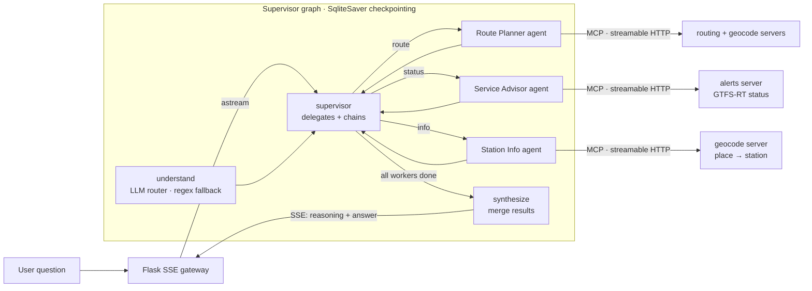

# Smart City Navigator — Multi-Agent Transit Planner

A natural-language NYC subway planner built as a **LangGraph** *multi-agent system*:
a **supervisor** delegates each question to independent specialist agents
(Route Planner, Service Advisor, Station Info) that reason over **three MCP tool
servers** (live GTFS-RT alerts, transfer-aware Dijkstra routing, geocoding) speaking the
**Model Context Protocol over streamable HTTP**, exposed through a **Flask
Server-Sent-Events gateway** that streams the agents' reasoning live, and measured by
**four separately-scored eval sets** with **LangSmith tracing**.

Ask *"How do I get from Times Square to Coney Island?"* and watch the agents
route the question, call the tools, and synthesize a grounded itinerary — never a
hallucinated one.

```
Take the N from Times Sq-42 St to Coney Island-Stillwell Av (16 stops).
About 50 min, 16 stops, no transfers.
```

It plans over the **whole subway**: all 475 stations and 1,096 segments, built from
the MTA's own GTFS schedule feed, with per-line run times so an express hop
genuinely beats the local. Live service comes from the
public GTFS-RT alerts feed, with a fault-tolerant simulation fallback that is
always *labelled* as simulated.

---

## Architecture



Each specialist is its **own** LangGraph agent — its own compiled `plan → tools →
finish` subgraph, persona/system prompt, and tool subset. The supervisor delegates
by intent and can **chain agents** for compound questions (*"...to Herald Sq and
are there delays?"* runs the Route Planner, hands it lines to the Service Advisor,
and merges). Each agent's tool loop is capped, and an agent that fails returns a
plain apology rather than taking the turn down with it.

Inside each agent the reasoner is whichever **chat model** is configured — Gemini,
an OpenAI-compatible endpoint, or a local Ollama model — doing the tool-calling
itself. With none configured, a **deterministic planner** (regex intent + entity
extraction) emits the *same* tool calls, so every agent, the MCP servers and the
whole eval suite run end-to-end in CI with no API key and zero flakiness.

The same choice governs the supervisor: with a model configured the **LLM routes**
each question (intent, and whether a trip question also needs a service check) and
the regex planner becomes the fallback for a malformed reply or an unreachable
endpoint. A flaky model degrades the routing; it never breaks the turn.

## Resume claims → where they live

| Claim | Implementation |
|---|---|
| **Multi-agent** transit planner — supervisor delegating to specialist worker agents | [`agent/graph.py`](src/navigator/agent/graph.py) (supervisor + routing), [`agent/workers.py`](src/navigator/agent/workers.py) (3 agents) |
| **LLM-driven** routing and tool choice, with a deterministic fallback | [`agent/nodes.py`](src/navigator/agent/nodes.py) (`classify_with_llm`), [`agent/llm.py`](src/navigator/agent/llm.py) (Gemini / OpenAI-compatible / local Ollama); exercised in CI by [`tests/test_llm_path.py`](tests/test_llm_path.py) |
| Plans over the **real network** — every station the MTA runs | [`core/data/subway_graph.json`](src/navigator/core/data/subway_graph.json), generated by [`scripts/build_graph.py`](scripts/build_graph.py) from the MTA GTFS feed |
| LangGraph orchestrator, **TypedDict state**, **conditional routing**, **SqliteSaver checkpointing** across query-understanding / route-planning / synthesis nodes | [`agent/graph.py`](src/navigator/agent/graph.py), [`agent/state.py`](src/navigator/agent/state.py), [`agent/nodes.py`](src/navigator/agent/nodes.py) |
| **3 MCP tool servers** (GTFS-RT alerts, Dijkstra routing, geocoding) with **FastMCP** over **streamable HTTP** | [`mcp_servers/`](src/navigator/mcp_servers/); booted as real processes and queried over HTTP in [`tests/test_mcp_http.py`](tests/test_mcp_http.py) |
| LLM acts on real-time MTA data **through a standardized protocol** | tools loaded via `langchain-mcp-adapters` `MultiServerMCPClient` — [`agent/tools.py`](src/navigator/agent/tools.py) |
| **Flask gateway** with **Server-Sent Events** for live agent-reasoning visibility | [`gateway/app.py`](src/navigator/gateway/app.py) |
| **LangSmith tracing** + eval sets (happy paths, ambiguous queries, tool-failure handling), graded against ground truth | [`eval/`](eval/) |
| Fault-tolerant execution / graceful degradation | SqliteSaver checkpoints (resumable) + GTFS-RT simulation fallback ([`core/mta_feed.py`](src/navigator/core/mta_feed.py)) |

## The specialist agents

The supervisor delegates to three independent worker agents, each with its own
persona and tool subset ([`agent/workers.py`](src/navigator/agent/workers.py)):

| Agent | Owns | Handles |
|---|---|---|
| **Route Planner** | routing + geocode tools | "how do I get from X to Y" |
| **Service Advisor** | alerts tools | delays, suspensions, outages |
| **Station Info** | geocode + station tools | which lines serve X, nearest station |

## The three MCP servers

Each wraps one slice of the transit core and is independently runnable
(`python -m navigator.mcp_servers.<name>_server`).

| Server | Port | Tools |
|---|---|---|
| **alerts** | 8071 | `get_service_status`, `get_line_status`, `list_elevator_outages` |
| **routing** | 8072 | `plan_trip`, `plan_trip_by_id`, `list_stations` |
| **geocode** | 8073 | `geocode_place`, `resolve_station`, `nearest_station` |

## Quickstart

```bash
make install          # venv + dependencies
make test             # 109 tests, incl. the 3 MCP servers booted over HTTP
make lint             # ruff
make eval             # core 20-prompt suite
make eval-all         # all four sets (70 prompts)
make eval-heldout     # the 20 that first scored 15/20
make eval-wild        # the newest set
make graph            # rebuild the network from the MTA GTFS feed

# Run the whole system (3 MCP servers + gateway), then open http://localhost:8000
make run

# Or just talk to it on the CLI (no servers needed):
make demo Q='"How do I get from Bedford Av to Herald Sq?"'
```

CLI reasoning trace for a compound question: the supervisor chains two agents and
hands the Route Planner's lines to the Service Advisor.

```
Q: How do I get from Bedford Av to Herald Sq and are there delays?
  [understand] Understood the question; intent = 'route' (routed by planner).
  [supervisor] Supervisor routing to: route_planner
  [route_planner] Supervisor → route_planner: delegating the task.
  [route_planner] route_planner finished: Take the L from Bedford Av to 14 St …
  [supervisor] Supervisor routing to: service_advisor
  [service_advisor] Supervisor → service_advisor: delegating the task. Hand-off: route uses lines L, F.
  [service_advisor] service_advisor finished: Service on your route — L: Good Service; F: Delays …
  [supervisor] Supervisor routing to: synthesize
  [synthesize] Merged agent results into the final answer.

Answer: Take the L from Bedford Av to 14 St (4 stops); transfer to the F from 14 St to
        34 St-Herald Sq (2 stops). About 18 min, 6 stops, 1 transfer.

        Service on your route — L: Good Service; F: Delays — Expect delays. Check
        MTA.info for updates. (Live MTA feed unavailable — this status is simulated.)
```

That is the real trip: the L to 14 St, across the platform, then the F. The walk
inside the complex is folded into the transfer rather than announced as a leg.

## The network

`src/navigator/core/data/subway_graph.json` is generated from the MTA's published
GTFS static feed by [`scripts/build_graph.py`](scripts/build_graph.py) and committed,
so the app needs no network at runtime:

| | |
|---|---|
| **475** stations | every GTFS parent station with weekday service |
| **1,096** segments | each carrying a *per-line* median run time from weekday schedules |
| **151** walking transfers | official passageways, plus the short in-complex links GTFS omits |
| **28** routes | including express variants (`6X`) and the three shuttles |

Two modeling decisions do most of the work:

- **Per-line segment times.** The 4 and the 6 both run Grand Central → 125 St, and
  the feed says how long each takes. Pricing segments per line is what lets the
  planner prefer the express without special-casing anything.
- **Station complexes.** Times Sq-42 St is four GTFS parent stations (plus Port
  Authority); 86 St is six unrelated stations across the city. Parents joined by a
  transfer — or sharing a name within 400 m — are unioned into one complex, so
  "Times Square" resolves cleanly while "86 St" still asks *which one*, naming the
  lines to choose between ("86 St (1/2) or 86 St (4/5/6)…").
- **Naming is not connection.** Sharing a name makes two platforms one *place* to
  ask about; only an official transfer or a passageway-length walk (≤150 m) makes
  them one station you can walk between. 86 St on the Lexington Av line and 86 St on
  2 Av are 350 m apart with no link, so the agent answers for one and offers the
  other — it never implies a transfer the MTA doesn't sell.

```bash
make graph     # re-download the feed and rebuild the JSON
```

## Choosing a reasoner

The agent runs with no model at all, with a hosted one, or with a local one — the
graph, the tools and the evals are identical in each case:

```bash
# 1. No configuration: the deterministic planner. What CI uses.
make eval

# 2. Hosted (Gemini)
export GEMINI_API_KEY=...
make eval

# 3. Local, no key, nothing leaves the machine
ollama pull qwen3:8b
export NAVIGATOR_LLM_PROVIDER=ollama NAVIGATOR_MODEL=qwen3:8b
make eval

export LANGSMITH_API_KEY=...          # every node/tool call becomes traceable
python eval/run_eval.py --langsmith   # scored experiment logged to LangSmith
```

Every eval report names the reasoner that produced it (`reasoner=ollama:qwen3:8b`),
so a score can never be quoted without saying what generated it.

## Evaluation

Four sets, scored separately, because a suite written alongside the thing it
grades will always flatter it:

| Set | What it is | First score | Status |
|---|---|---|---|
| **core** (20) | the suite the agent was built against | — | tuned on |
| **held-out** (20) | the same jobs typed how people type: typos, no punctuation, slang | **15/20** | spent — its gaps were fixed |
| **fresh** (15) | written after the planner froze | **11/15** | spent |
| **wild** (15) | written after *those* fixes | **13/15** | spent |

Each set is written against the finished parser, scored **once**, and then — if it
found anything — spent, because fixing what it caught means the parser has now seen
it. So a new one gets written. The first scores are the honest ones, and the
trajectory is the real result: **15/20 → 11/15 → 13/15**, each generation finding
less. All four now pass 100%, which says nothing about the next set; when a new one
stops finding anything, the parser has stopped being the bottleneck.

What the three generations actually caught, in order: service questions with no
service vocabulary (*"any problems on the J?"*), lookups phrased as commands
(*"show me the trains at Atlantic Av"*), a line named with no other clue (*"what's
the deal with the 7 today"*), a pronoun taken for a station (*"get me to Wall St"*
planned a trip from "me"), and verbs left glued to place names (*"need to reach
Barclays Center"* snapped to a landmark instead of the station).

**Grading is against ground truth, not vocabulary.** For a route question the grader
resolves the endpoints itself, plans the trip with the routing engine, and then
requires the answer to ride exactly those lines in that order, reach that station,
and quote a time within two minutes of the computed one — and to name *no* line the
real itinerary doesn't use. Status answers are checked against what the feed reports
for that line at that moment. Keyword matching can't tell a correct itinerary from a
fluent wrong one; this can.

### Scores

Same graph, same tools, same prompts — only the reasoner differs. The planner is
scored twice: the number each set gave on its first run, and where it stands after
the gaps that set exposed were fixed.

| Set | Planner, first run | Planner, now | Local `qwen3:8b` |
|---|---|---|---|
| core (20) | — (built against it) | **20/20** | 16/20 |
| held-out (20) | 15/20 | **20/20** | 16/20 |
| fresh (15) | 11/15 | **15/15** | 10/15 |
| wild (15) | 13/15 | **15/15** | not scored |
| per question | | ~0.01s | 29.7s median |

The comparison is more useful than the totals. The model is **better at language
and worse at discipline**:

- It needs no vocabulary list. "trains messed up on the 6?", "what's the deal with
  the 7 today" and "hows the L looking" all just work — each of those cost the
  planner a held-out failure and a regex patch.
- It loses on the things the deterministic composer gets for free. Its 13 remaining
  failures are almost all completeness and consistency: naming only 4 of the 10 lines
  a station complex serves, planning the Q when its own tool returned the N, and
  refusing without saying what it couldn't find.

So on this narrow, fully-specified task the regex planner is still the better
answerer, at a millisecond instead of half a minute — and it is not a fallback that
happens to work, it is the thing that works. The model earns its place on input
nobody wrote a rule for, which is exactly what the held-out sets keep proving is a
bottomless supply.

Running a real model was also the only way three agent bugs surfaced, all of them
mine rather than the model's:

- a tool schema that rejected `line=7` as an integer — the agent then spent every
  retry re-sending the same rejected call;
- two near-identical tools (`plan_trip` / `plan_trip_by_id`) that invited the model
  to mix their argument names;
- a tool loop with no cap, which ran to the graph's recursion limit and killed an
  entire eval run.

Fixing those took the same model from 30/55 to 42/55 without touching a prompt.

The suites run with the live GTFS-RT feed stubbed, so every status answer also
exercises the fault-tolerant simulation fallback. Multi-agent chaining is pinned by
tests rather than prompts — `tests/test_multiagent.py` and `tests/test_regressions.py`
assert which agents ran, what the supervisor handed between them, and that an
express leg is checked under its rider-facing line. CI (`.github/workflows/ci.yml`)
gates merges on `ruff`, `pytest` and 100% across all four prompt sets, on Python
3.10 and 3.11.

## Project layout

```
src/navigator/
  core/          transit domain — graph, routing, geocode, GTFS-RT feed, cache (no frameworks)
  mcp_servers/   3 FastMCP servers over streamable HTTP
  agent/         supervisor graph, specialist worker agents, state, LLM factory + planner, tool loading
  gateway/       Flask JSON + SSE gateway (+ live demo page)
  core/data/     subway_graph.json — the network, generated from the MTA GTFS feed
eval/            four prompt sets, ground-truth graders, runner (LangSmith optional)
scripts/         build_graph.py (GTFS → graph), run_all.sh (servers + gateway), demo.py (CLI)
tests/           109 unit + integration tests (incl. live MCP-over-HTTP and the LLM path)
```

## Design notes

- **Genuinely multi-agent.** A supervisor delegates to three independent worker
  agents, each its own compiled subgraph with a distinct persona and tool subset;
  compound questions chain agents and merge results (see `tests/test_multiagent.py`).
- **Tool schemas meet models where they are.** A local model called
  `get_line_status(line=7)` with an integer; the string-only schema rejected it,
  and the agent spent all three retries re-sending the same rejected call. Line
  and coordinate arguments now accept the types models actually send and coerce
  them. Running a real model surfaced it — no amount of reading the code would have.
- **The model is in the loop, and the loop survives it.** With a model configured
  the LLM routes the question and picks the tools; the regex planner catches
  malformed JSON, an invalid intent, or a dead endpoint. Each agent's tool loop is
  capped at three rounds — a local 8B model that answered every turn with another
  tool call used to run to the recursion limit and kill the turn — and an agent that
  raises returns an apology instead of a stack trace. `tests/test_llm_path.py` drives
  all of that with a scripted model, so CI exercises the LLM path without a key.
- **The whole network, from the source of record.** 475 stations and per-line run
  times come from the MTA's GTFS feed via `scripts/build_graph.py`, not from a
  hand-written table, so "86 St" is honestly ambiguous, the 4 beats the 6 uptown,
  and Howard Beach is a real answer for JFK.
- **Agents hand off context, not just turns.** On a compound question the supervisor
  passes the lines of the Route Planner's itinerary to the Service Advisor, which
  checks exactly those lines instead of dumping all 23 (`tests/test_regressions.py`).
- **Two transports, one implementation.** Tools load either from the live MCP servers
  (`--transport mcp`) or in-process (`inprocess`). The in-process tools are generated
  from the MCP servers' own functions, so names, schemas, and behavior cannot drift
  (a test asserts schema parity). CI runs both: the hermetic in-process path and the
  3 servers booted as real processes over streamable HTTP.
- **Transfer-aware routing.** Dijkstra runs over (station, line) states with a
  4-minute transfer cost, so it never trades a one-seat ride for two changes to save
  a minute; links no single line serves become explicit walking legs.
- **Fault tolerance is real, not claimed.** `test_checkpoint_persists_to_disk_and_resumes`
  proves a run written by one session is recovered by a *fresh* session from the same
  sqlite file; the feed pipeline answers through an upstream outage via the simulation.
- **Grounded or it doesn't answer.** On unresolvable input the agent says so instead
  of inventing a route — asserted by `test_bad_endpoints_do_not_fabricate_a_route`.
  The same rule covers data provenance: planned work that hasn't started yet is not
  reported as current (GTFS-RT `active_period`), simulated status is labelled as
  simulated, a landmark snapped to a station says so (and one too far from any
  station, like JFK, is refused), and "no elevator outages" is never claimed when the
  outage feed couldn't be read.
- **Scores say what produced them.** Every eval report names its reasoner, the four
  sets are scored apart, and each says whether it has been tuned on. A number without
  that context is worth nothing — and a set scored twice is worth less than the first
  number it gave.
- **Conversations don't bleed.** Per-turn fields use a resetting reducer, so a reused
  checkpointed `thread_id` keeps its message history but can't replay the previous
  question's answer; the gateway gives every request its own thread unless the caller
  passes one.
